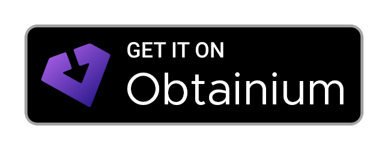
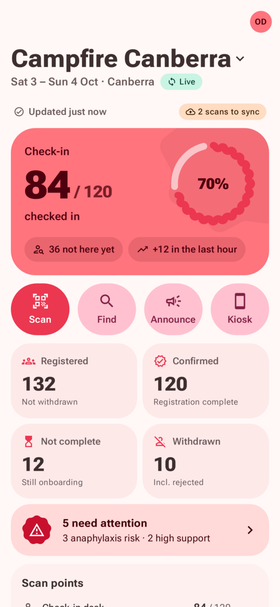
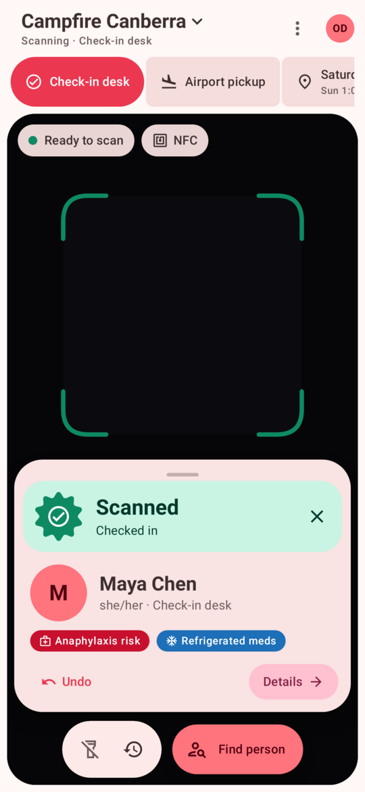
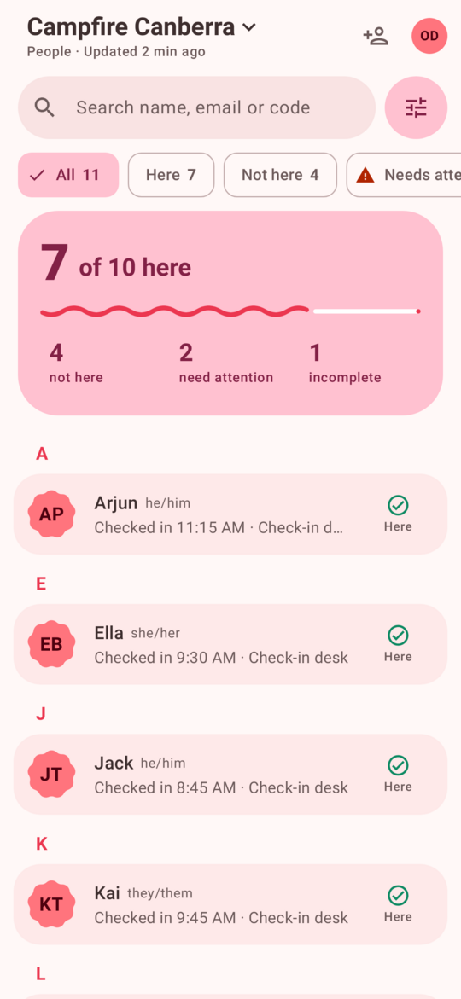
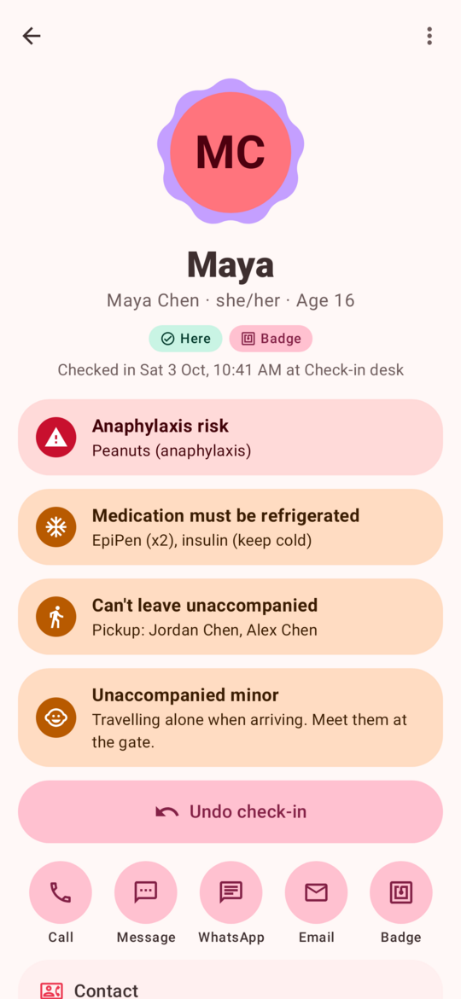
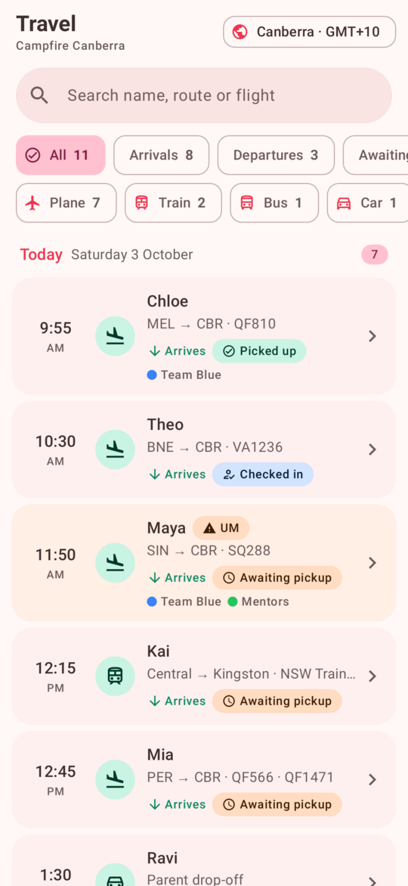
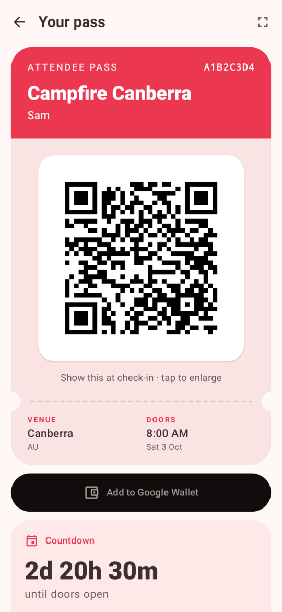

<div align="center">


# BetterAttend

**A Hack Club Attend client for Android and iOS**<br>
Faster, native, and offline-first

<a href="https://apps.obtainium.imranr.dev/redirect?r=obtainium://add/https://github.com/ingoau/better-attend"></a>

[](https://github.com/ingoau/better-attend/releases/latest)


[**Download the APK**](https://github.com/ingoau/better-attend/releases/latest) · [Website](https://ingoau.github.io/better-attend/) · [iOS notes](ios/README.md)

<br>

<table>
  <tr>
    <td align="center"><picture><source media="(prefers-color-scheme: dark)" srcset="docs/screenshots/home-dark.png"></picture><br><sub><b>Live dashboard</b></sub></td>
    <td align="center"><picture><source media="(prefers-color-scheme: dark)" srcset="docs/screenshots/scan-dark.png"></picture><br><sub><b>Scan QR + NFC</b></sub></td>
    <td align="center"><picture><source media="(prefers-color-scheme: dark)" srcset="docs/screenshots/people-dark.png"></picture><br><sub><b>People</b></sub></td>
  </tr>
  <tr>
    <td align="center"><picture><source media="(prefers-color-scheme: dark)" srcset="docs/screenshots/participant-dark.png"></picture><br><sub><b>Participant detail</b></sub></td>
    <td align="center"><picture><source media="(prefers-color-scheme: dark)" srcset="docs/screenshots/travel-dark.png"></picture><br><sub><b>Travel and pickups</b></sub></td>
    <td align="center"><picture><source media="(prefers-color-scheme: dark)" srcset="docs/screenshots/ticket-dark.png"></picture><br><sub><b>Offline tickets</b></sub></td>
  </tr>
</table>

</div>

## About

BetterAttend is an unofficial app, not made by Hack Club: native rewrites of Hack Club's
[Attend](https://attend.hackclub.com) mobile app
([Play Store](https://play.google.com/store/apps/details?id=com.hackclub.attend)):

- **[`android/`](android)** — Kotlin, Jetpack Compose and **Material 3 Expressive**.
- **[`ios/`](ios)** — Swift and SwiftUI (iOS 18+, Liquid Glass on iOS 26), with WidgetKit widgets,
  a Control Center control and Siri / Spotlight shortcuts. Same features, built the iOS way; see
  [`ios/README.md`](ios/README.md).

Both use the same backend ([hackclub/attend](https://github.com/hackclub/attend)) and sign in
with the same Hack Club OAuth client as the official app, so any existing Attend account works.
They show up as **BetterAttend** and install **alongside** the official app.

## What's in it

**For organizers**

- **Home dashboard** — live "84 / 120 checked in" with an expressive progress ring, not-here-yet and
  last-hour counts, per scan-point progress, arrivals to collect, people needing attention, recent
  check-ins and one-tap actions (Scan · Find · Announce · Kiosk).
- **Share stats** — press and hold any number on Home to share it as an image card: event name, the
  number (add up to six more), `inw.sh/better-attend` at the bottom. Pick colour, style (Tonal · Bold ·
  Playful · Outline), layout (Row · Grid · List), light/dark, and whether to show icons, dates and
  totals; then share it or save it to Pictures (Photos on iOS, where the long-press opens a
  "Share as Image…" menu).
- **Scan** — continuous QR scanning (CameraX + on-device ML Kit, works offline), **NFC badge reading**
  (the old app had no Android NFC), scan-point selector, big colour-coded results with safety alerts,
  undo, sounds + haptics, recent-scans log, and "Find person" for manual check-ins.
- **Server-confirmed scans** — a scan shows "Confirming…" from the cached roster straight away and
  only turns green once Attend confirms it. If Attend turns it down (or its record says the person
  has withdrawn or hasn't signed the waiver), the scanner buzzes, plays the error sound and raises a
  red banner naming the person and the reason that stays until dismissed.
- **Offline first** — when Attend can't be reached within 5 s, the scan is checked against the cached
  roster (withdrawn, missing consent, wrong event, already checked in, not registered) and only
  queued if it passes, with the roster's age on the card. Queued scans keep their original time,
  retry automatically (WorkManager) with idempotent `client_scan_id`s, and any Attend rejects on
  sync are notified and listed on Home. Rosters, tickets and travel are cached encrypted with an
  Android Keystore key; if that key is unavailable nothing is written to disk and the app says it's
  running online only.
- **People** — instant search (name, email, pronouns, short code), filter chips with live counts
  (Here / Not here / Needs attention / Not complete / Withdrawn), advanced filters and sorting.
- **Participant detail** — safety alerts first, check in / undo per scan point, a Contact sheet
  (call · SMS · WhatsApp · email · Slack DM), tap the photo to see it full screen, travel legs with
  live flight status, medical/accessibility/safeguarding (role-gated), guardians, consents, notes
  with type + sensitivity, and **NFC badge writing** (ensure → write → verify → confirm).
- **Travel** — arrivals/departures by day in the event timezone, pickup states, UM flags.
- **Announcements** — send Slack blasts with confirmation and live delivery progress.
- **Kiosk mode** — self check-in on a spare phone/tablet: front camera, pinned screen, PIN to exit.
- **Edit details** — fix a name, email, phone, pronouns, T-shirt size or date of birth from the
  participant page; **Remove from event** for admins (withdrawing stays the reversible option).
- **Invite walk-ins** — add someone by email from People: they're put on the roster as invited and
  emailed a link to finish registering.
- **Event staff** — add volunteers by email, change roles or remove them, from Settings.
- **Roll call** — a muster headcount from the cached roster that works offline: freeze who should be
  here, tick people off, see who's missing, share the list. Optionally record ticks as scans at a
  scan point you pick.
- **First-aid sheet** — everyone with medical or safety flags, with allergies, medications and
  emergency contacts for safeguarding leads and global admins; works offline and prints or saves as PDF.
- **Role-aware** — actions only appear for roles Attend allows (e.g. only event admins see
  Invite, Event staff and Remove), so nobody hits a "Forbidden" error.

**For participants**

- **My tickets** — works offline at the door; pass with a high-contrast QR that **boosts screen
  brightness** automatically, full-screen QR, Google Wallet, countdown, directions, arriving
  travel, organiser messages and safety contacts.

**Home-screen widgets** (Jetpack Glance, Material You, light + dark, resizable)

- **Check-in progress** — count, progress bar, not here yet; larger sizes add per-scan-point rows.
- **Arrivals** — awaiting pickup / collected / checked in + next arrival.
- **Quick scan** — one tap straight into the scanner.
- **My ticket** — next event countdown, opens your pass.

Widgets refresh in the background every 15 minutes (and instantly when the app has new data),
staying well inside Attend's shared 300 requests / 5 min per-IP rate limit.

Also: dark mode everywhere (System / Light / Dark), optional wallpaper colours, adaptive layout with
a navigation rail on tablets, app shortcuts, and no analytics or session recording.

## iOS

Open `ios/Attend.xcodeproj` in Xcode 26+ and run the **Attend** scheme, or from the command line:

```sh
cd ios
xcodebuild -project Attend.xcodeproj -scheme Attend \
  -destination 'platform=iOS Simulator,name=iPhone 17 Pro' test   # unit + UI tests
```

Each [release](https://github.com/ingoau/better-attend/releases/latest) includes an unsigned
`.ipa` you can sideload with [AltStore](https://altstore.io) or [SideStore](https://sidestore.io).
With a free Apple ID it needs refreshing every 7 days, and widgets and NFC may not work.

Launch with `-AttendDemo YES` to try every screen against a built-in fake event (no account
needed). Running on a device needs your Apple developer team set in Signing & Capabilities (App
Groups for widgets, NFC Tag Reading for badges). iOS equivalents of the Android extras: Apple Wallet
passes, Home Screen and Lock Screen widgets, a Scan Tickets control, Home Screen quick actions,
Siri / Spotlight shortcuts and Guided Access for kiosk mode. NFC reading on iOS uses the system
scan sheet (tap "Scan NFC Badge"), as iOS doesn't allow always-on background tag reading.

## Android: Install

The easiest way is [Obtainium](https://obtainium.imranr.dev), which installs BetterAttend straight
from GitHub releases and keeps it updated:
[**add BetterAttend to Obtainium**](https://apps.obtainium.imranr.dev/redirect?r=obtainium://add/https://github.com/ingoau/better-attend).

Or download an APK from the [latest release](https://github.com/ingoau/better-attend/releases/latest) —
`BetterAttend-<version>-arm64-v8a.apk` fits almost every phone, `BetterAttend-<version>-universal.apk` runs
everywhere — then open it on your phone and allow installing from that source. Android 8.0+.
Builds of unreleased changes are under **Actions → Android → attend-apk**.

## Android: Build

Requirements: JDK 17+ and the Android SDK (platform 37, build-tools 37).

```sh
cd android
./gradlew :app:assembleRelease        # → app/build/outputs/apk/release/app-release.apk
./gradlew :app:testDebugUnitTest      # unit, screenshot (Roborazzi) and end-to-end smoke tests
```

Screenshot tests render every screen in light and dark mode on the JVM into
`android/app/build/outputs/roborazzi/`, using the sample event in `ui/preview/` (Campfire Canberra).
The README and website screenshots in [`docs/screenshots/`](docs/screenshots) come from these; refresh
them with `docs/update-screenshots.sh` after running the tests. `AppSmokeTest` boots the real app
against a mock Attend API and walks every tab, including a real check-in.

### Signing

Release builds are signed with your key if one is configured, otherwise with the debug key (so the
APK always installs). Configure either via environment variables

```
ATTEND_KEYSTORE_FILE, ATTEND_KEYSTORE_PASSWORD, ATTEND_KEY_ALIAS, ATTEND_KEY_PASSWORD
```

or a gitignored `keystore.properties` in `android/` (`storeFile`, `storePassword`, `keyAlias`,
`keyPassword`). In CI, set the `ATTEND_KEYSTORE_BASE64` secret (plus the three others) to publish
updates signed with a stable key. The release workflow requires them.

## Releasing

Push a version tag and GitHub builds both apps and publishes them as a release:

```sh
git tag v1.3.0 && git push origin v1.3.0
```

The tag sets the version name, and the version code is derived from it (`v1.3.0` → `10300`), so
there's nothing to bump by hand.

## How sign-in works

Authorization Code + PKCE against `auth.hackclub.com` using the official app's OAuth client and
its registered redirect `attend://oauth/callback`, opened in an **Auth Tab** (falls back to a Custom
Tab; on iOS an `ASWebAuthenticationSession`). The code is exchanged by the Attend backend (`POST /api/v1/session`), which returns a 14-day
mobile token that the app rotates automatically. Your account must already exist in Attend.

**Settings → Developer → Copy a new mobile token** runs that whole sign-in again with a fresh PKCE
pair and copies the newly issued token to the clipboard, for scripts and other tools. It never
reuses or sends the app's own token, and the app stays signed in with its own session.

## Known limitations

- **Push notifications** aren't supported: the Attend backend only accepts Expo push tokens.
- **Live updates** use polling; Attend's ActionCable channel only accepts browser cookies.
- If the official app is also installed, Android may ask which app should finish signing in
  on older browsers without Auth Tab support — pick this one.

## Layout

```
android/app/src/main/java/au/ingo/betterattend/
  data/api      Attend API client + models        data/repo   events, roster sync, scans + offline queue, tickets, travel
  data/auth     Hack Club OAuth (PKCE)             data/store  encrypted cache, settings
  ui/           Compose screens (dashboard, scan, people, travel, blasts, tickets, settings, login)
  widget/       Glance widgets + background sync   scan/       scan sync worker
ios/
  Shared/       models + pure logic (shared with widgets)   Attend/Data   API, auth, stores, repositories
  Attend/UI/    SwiftUI screens                              AttendWidgets/ WidgetKit widgets + control
```
